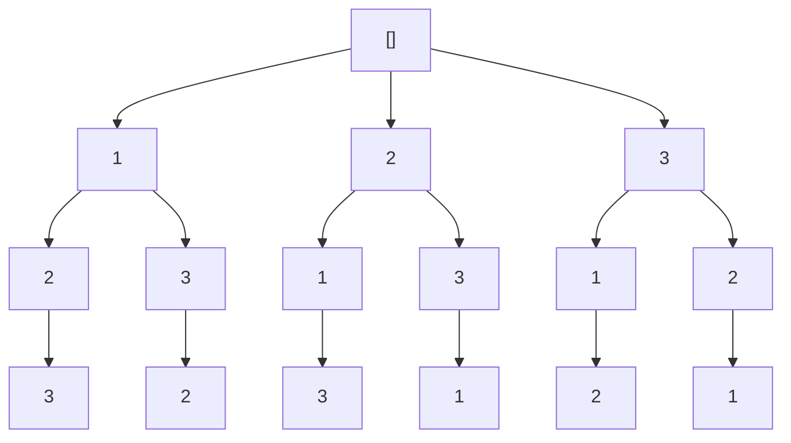

<a id="readme-top"></a>

<br />
<div align="center">
  <a href="https://leetcode.com">
    
  </a>

  <h3 align="center">X. All permutations</h3>

  <p align="center">
    Problem details and solution(s)
    <br />
    <br />
    <br />
  </p>
</div>

## About The Problem

Given an array of numbers, return all permutations of these numbers.

Return a list of lists containing all permutations for each number.

## Case examples

- Given `numbers = [1, 2, 3]`, the expected output is `[[1, 2, 3], [1, 3, 2], [2, 1, 3], [2, 3, 1], [3, 1, 2], [3, 2, 1]]`

<p align="right">(<a href="#readme-top">back to top</a>)</p>

## Intuition

This is a classic backtracking problem that involves crating the state space tree of all given solutions (permutations) for each number.
To illustratre this problem we will consider this set of numbers : `[1,2,3]`

the resulting tree would be :



<p align="right">(<a href="#readme-top">back to top</a>)</p>

## Code

```py
def generate_permutations(numbers: list):
    result = []
    def permute_number(path,remaining):

        if not remaining:
            result.append(path[:]) # Need to shallow copy the path in order to freeze the values at this state.

        for index, value in enumerate(numbers):
            path.append(value)
            permute_number(path, remaining[:index] + remaining[index+1:]) # Prune current value for the next permutation
            path.pop() # Backtrack
        return result
    return permute_number([],numbers)
```

<p align="right">(<a href="#readme-top">back to top</a>)</p>
