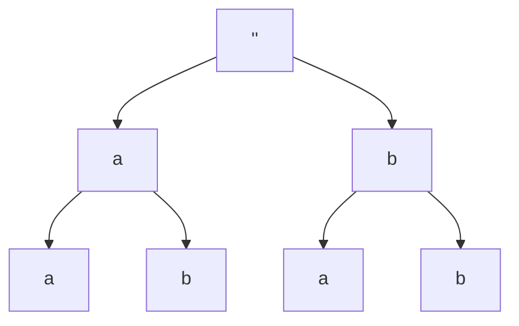

<a id="readme-top"></a>

<br />
<div align="center">
  <a href="https://leetcode.com">
    
  </a>

  <h3 align="center">X. All two letters words of length n</h3>

  <p align="center">
    Problem details and solution(s)
    <br />
    <br />
    <br />
  </p>
</div>

## About The Problem

Given an array of two letters, create all words made of these 2 letters of length **n**.

Return must be a list of lists containing all words for each depths [[depth_0_word],[depth_1_words],[depth_2_words]]

## Case examples

- Given `letters = ['a','b']` and `k = 2`, the expected output is `[[''], ['a', 'b'], ['aa', 'ab', 'ba', 'bb']]`

- Given `letters = ['a','b']` and `k = 3`, the expected output is `[[''], ['a', 'b'], ['aa', 'ab', 'ba', 'bb'], ['aaa', 'aab', 'aba', 'abb', 'baa', 'bab', 'bba', 'bbb']]`

<p align="right">(<a href="#readme-top">back to top</a>)</p>

## Intuition

To solve this problem, the easiest solution is to build the state space tree of all possible words by level. The resulting data structure will be a tree containing all solutions for each depth.

Here is an illustration of all words containing `letters = ['a','b']` and `k = 2`.



To build such a tree we need a Node class that will be initialized with 2 properties, a `value` and eventually a `children`.

```py
class Node:
  def __init__(value: int, children: list = None):
    self.value = value
    self.children = children if children else []
```

Addtionnaly we can also write a `display` method that will print the generated tree in a nice format. This will use a BFS traversal for each level.

```py
class Node:
  def display(self):
    queue = [self]
    level = []
    result = []

    while queue:
      level = []
      for _ in range(len(queue)):
        current_node = queue.pop(0) #NOTE : Use dequeu for optimized pop().
        level.append(current_node.value)
        queue.extend(current_node.children) # As children is a list we extend the queue instead of appending to it.
      result.append(level)
    print(result) # Or return result if you prefer
```

The setup being done we can now dive into the main logic.

<p align="right">(<a href="#readme-top">back to top</a>)</p>

## Code

```py
def generate_all_words(letters: list, depth: int):
  def generate_word(current_word: string, depth: int):

    if depth == 0:
      return Node(current_word)
    root = Node(current_word)

    for letter in letters:
      child = generate_word(current_word+letter, depth-1)
      root.children.append(child)

    return root
  return generate_word('',depth) # Root // base word is an empty word
```

<p align="right">(<a href="#readme-top">back to top</a>)</p>
